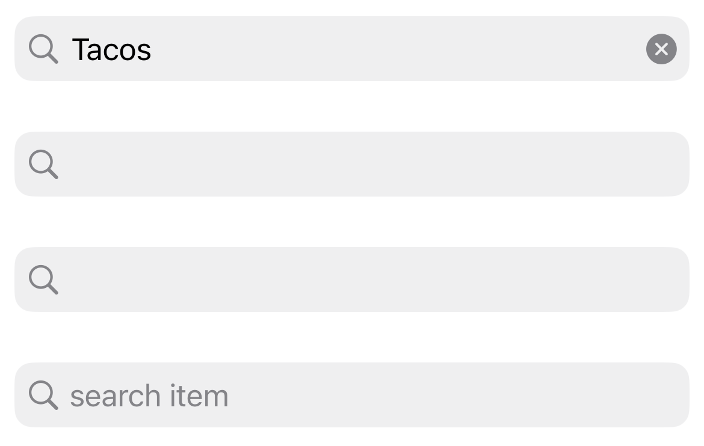
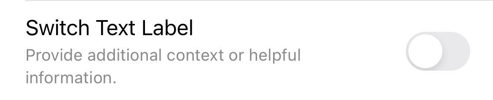
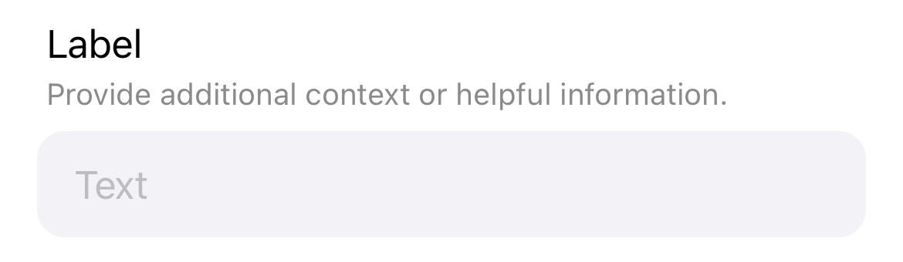
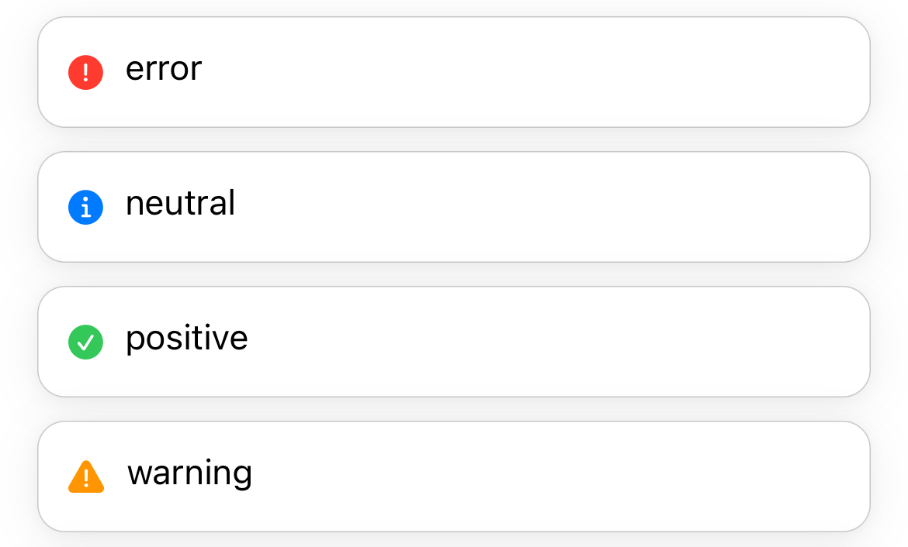
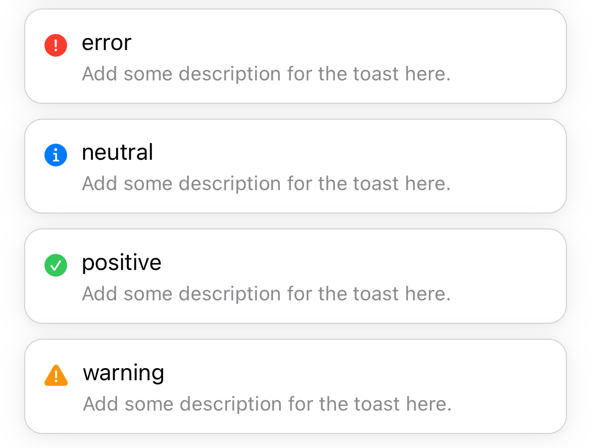
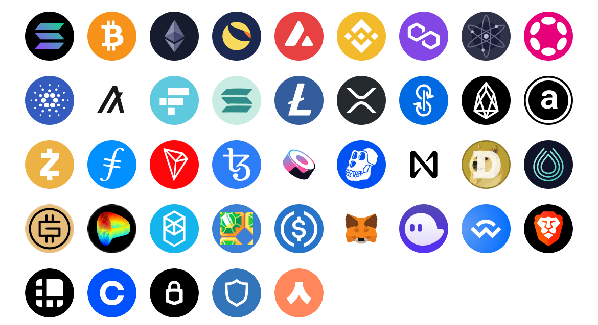

# SnowballSwiftKit

Lots to do!! SwiftUI Component Kit supporting iOS 15.0+.

Packages: 
- `SnowballSwiftKit`: SwiftUI Component Kit (for now very basic but soon flows like login etc)
- `SnowballAssetKit`: Common crypto assets (as png and sf symbols)

## Getting Started

- Easiest way to open is via the bash script `start` or `SnowballSwiftExample/SnowballSwiftExample.xcodeproj`
- [swiftlint](https://github.com/realm/SwiftLint)
    - fix all? `swiftlint --fix` (install via brew @ `brew install swiftlint`)
    - `.swiftlint.yml` enforce rules
- Config.xcconfig
    - For now, until an app wide `SnowballSettings` is arch, edit `Config.xcconfig` with API Keys to test out some of the custom views such as `SnowballNFTGridView` and `SnowballNFTListView`. 
    - Read more on [Config / Dev Mode](https://nshipster.com/xcconfig/)
- [Fastlane](https://fastlane.tools)
    - generate screenshots + automate deployment
    - [setup](https://docs.fastlane.tools/getting-started/ios/setup/)
- [Convert SVG To SF Symbols](https://github.com/snowball-tools/ConvertSVGToSFSymbol)

## Soon 
(send me a telegram @vivianphung if u want anything sooner)
- `SnowballSettings` for app wide configs
- Login with wallet / email flow
- Snowball Kit documentation site
- `SnowballKotlinKit` (for [Jetpack](https://developer.android.com/jetpack))

## `SnowballSwiftKit` Documentation

V0 (rough rough start) are ready! 

- `SnowballAvatar`
- `SnowballAvatarRemoteStack`
- `SnowballAvatarStack`
<br>

- `SnowballButton`
    - for convenience, left + right system icons or images and text. 
    - `SnowballButtonStyles`: `snowballDefault`, `snowballTinted`, `snowballFilled`, `snowballDanger`
        - set via `.buttonStyle(.snowballFilled)` or 
        - also styles Apple's `Button`
- `SnowballNFTGridView`
- `SnowballNFTListView`
- `SnowballSearchBar`
<br>

- `SnowballSwitchLabel`
<br>

- `SnowballTextInput`
<br>

- `SnowballToastView`
    - `SnowballToastType`: `error`, `warning`, `neutral`, `positive`
    
<br>

- `SnowballTitleLabel`
<br>

## `SnowballAssetKit` Documentation
<br>

Asset library of common token symbols and wallets 
- token symbols: `sol`, `btc`, `eth`, `avax`, `bnb`, `matic`, `atom`, `dot`, `ada`, `algo`, `ftt`, `msol`, `ltc`, `xrp`, `yifi`, `eos`, `ar`, `sec`, `fil`, `trx`, `xtz`, `sushi`, `ape`, `near`, `doge`, `srm`, `gmt`, `crv`, `ftm`, `jewel`, `usdc`
- wallets: `snowball`, `metamask`, `phantom`, `walletConnect`, `brave`, `ledger`, `coinbaseWallet`, `trezor`, `trust`, `argent`

use symbols via 

### SwiftUI
```
SnowballImage(.sol) // Image
SnowballImage(.sol, .sfSymbol) // SF Symbol
```
- tokens: `SnowballImage("SOL")`
- wallets: `SnowballImage("snowball_circle")`, `SnowballImage("snowball_icon")`, or `SnowballImage("snowball_square")`

### UIKit
```
SnowballUIImage(.sol)
SnowballUIImage(.sol, .sfSymbol) // SF Symbol
```
- tokens: `SnowballUIImage("SOL")`
- wallets: `SnowballUIImage("snowball_circle")`, `SnowballUIImage("snowball_icon")`, or `SnowballUIImage("snowball_square")`
